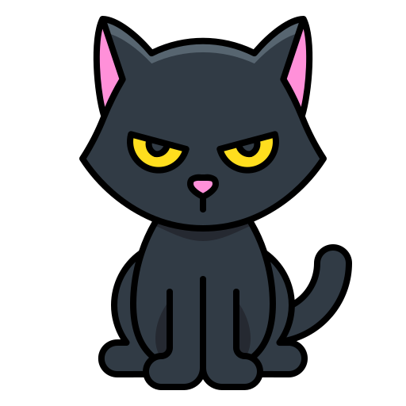
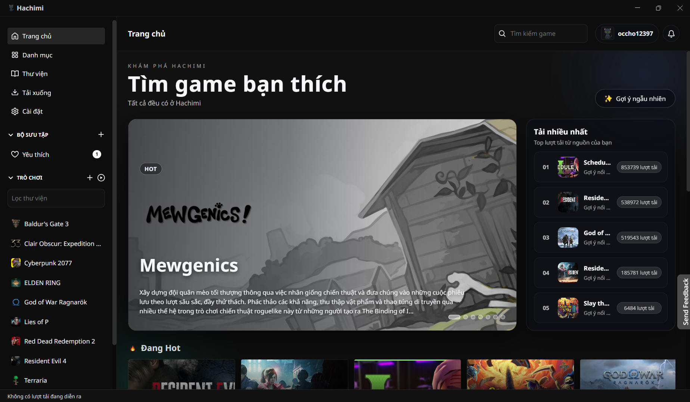

<div align="center">

  

  <h1 align="center">Hachimi Launcher</h1>

  <p align="center">
    <strong>Hachimi is an open-source game library manager built with Node.js (Electron, React, TypeScript) and Python.</strong>
  </p>

  

</div>

## Features

- Manage your game library
- Cloud save sync
- Achievements and profile
- Rich catalogue with smart suggestions
- Lightweight and easy to use

## Development

### Requirements

- Node.js + Yarn
- Python 3.x

### Install

```bash
yarn install
```

### Dev

```bash
yarn dev
```

### Build Windows

```bash
yarn build:win
```

## License

MIT