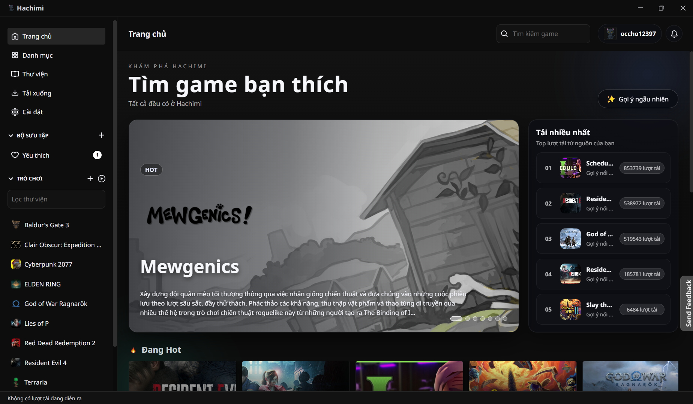

<div align="center">

  

  <h1 align="center">Hachimi Launcher</h1>

  <p align="center">
    <strong>Hachimi is an open-source game library manager built with Node.js (Electron, React, TypeScript) and Python.</strong>
  </p>

  

</div>

# 🎮 Hachimi Launcher

[](https://www.typescriptlang.org/)
[](https://www.electronjs.org/)
[](https://react.dev/)
[](https://www.python.org/)
[](https://vitejs.dev/)
[](LICENSE)

**Game Library Manager - Công cụ quản lý thư viện trò chơi hiệu quả với hỗ trợ cloud save, achievements, và gợi ý thông minh**

---

## 📌 Giới Thiệu

Hachimi Launcher là một ứng dụng desktop hiện đại được xây dựng bằng **Electron** + **React** + **TypeScript**, giúp bạn:

- 🎮 **Quản lý thư viện game** - Tổ chức và theo dõi game của bạn
- ☁️ **Cloud Save Sync** - Sao lưu trò chơi tự động lên cloud
- 🏆 **Achievements & Profile** - Theo dõi thành tích và hồ sơ
- 🤖 **Smart Suggestions** - Gợi ý game dựa trên sở thích
- 📊 **Rich Catalogue** - Thư mục game phong phú
- ⚡ **Lightweight & Fast** - Ứng dụng nhẹ, chạy nhanh
- 🎨 **Modern UI** - Giao diện đẹp và dễ sử dụng

---

## 🎯 Tính Năng Chính

### 🎮 Quản Lý Thư Viện Game
- ✅ Thêm/loại bỏ game khỏi thư viện
- ✅ Tổ chức game theo thể loại
- ✅ Yêu thích game
- ✅ Ghi chú về game
- ✅ Quản lý thời gian chơi

### ☁️ Cloud Save Management
- ✅ Sao lưu save game tự động
- ✅ Đồng bộ save giữa các thiết bị
- ✅ Khôi phục save game
- ✅ Lịch sử phiên bản save
- ✅ Hỗ trợ nhiều tài khoản

### 🏆 Achievements & Profiles
- ✅ Theo dõi achievements
- ✅ Thống kê chơi game
- ✅ Hồ sơ người chơi
- ✅ Biểu đồ tiến độ
- ✅ So sánh với bạn bè

### 🤖 AI-Powered Recommendations
- ✅ Gợi ý game dựa trên sở thích
- ✅ Phân loại game thông minh
- ✅ Xu hướng game phổ biến
- ✅ Đánh giá cộng đồng

### 🎨 Giao Diện & Trải Nghiệm
- ✅ Dark/Light theme
- ✅ Responsive design
- ✅ Tìm kiếm nhanh
- ✅ Sắp xếp linh hoạt
- ✅ Cấu hình tùy chỉnh

### 🔌 Integrations
- ✅ Steam API integration
- ✅ GOG integration
- ✅ Epic Games integration
- ✅ Discord rich presence
- ✅ External launcher support

---

## 🛠️ Công Nghệ Sử Dụng

### Frontend
- **TypeScript 5.0+** - Type-safe JavaScript
- **React 18+** - UI library
- **Vite 4.0+** - Build tool
- **SCSS 13.5%** - Styling
- **HTML 2.9%** - Markup

### Desktop
- **Electron Latest** - Desktop app framework
- **Electron Vite** - Build tools for Electron
- **Electron Builder** - Packaging & publishing

### Backend
- **Python 3.8+** - RPC backend service
- **FastAPI / Flask** - Web framework

### DevTools
- **ESLint** - Code linting
- **Prettier** - Code formatting
- **TypeScript** - Type checking

---

## 📦 Cấu Trúc Dự Án

```
Hachimi_Launcher/
├── src/                      # Source code
│   ├── main/                 # Main process (Electron)
│   │   ├── index.ts
│   │   └── ...
│   ├── preload/              # Preload scripts
│   │   └── index.ts
│   ├── renderer/             # Renderer process (React)
│   │   ├── src/
│   │   │   ├── App.tsx
│   │   │   ├── components/
│   │   │   ├── pages/
│   │   │   ├── hooks/
│   │   │   ├── utils/
│   │   │   └── styles/
│   │   ├── index.html
│   │   └── main.tsx
│   └── ...
├── resources/                # Assets, icons
│   ├── icon.png
│   ├── icon.icns
│   ├── icon.ico
│   └── ...
├── docs/                     # Documentation
├── build/                    # Build output
├── binaries/                 # Binary files
├── ludusavi/                 # Save game manager
├── python_rpc/               # Python RPC backend
│   ├── main.py
│   ├── requirements.txt
│   └── ...
├── scripts/                  # Build scripts
├── esbuild-bin/              # ESBuild binary
├── package.json
├── electron.vite.config.ts   # Vite config
├── electron-builder.yml      # Build config
├── tsconfig.json
├── .eslintrc.cjs
├── .env.example
└── ...
```

---

## 🚀 Hướng Dẫn Cài Đặt

### ✅ Yêu Cầu Hệ Thống
- **Node.js 14+** - Runtime
- **npm 6+** hoặc **yarn** - Package manager
- **Python 3.8+** - Cho RPC backend (tùy chọn)
- **Git** - Version control

### 1️⃣ Clone Repository

```bash
git clone https://github.com/DevBaor/Hachimi_Launcher.git
cd Hachimi_Launcher
```

### 2️⃣ Cài Đặt Dependencies

```bash
# Cài đặt Node dependencies
npm install
# hoặc
yarn install

# (Tùy chọn) Cài đặt Python dependencies
cd python_rpc
pip install -r requirements.txt
cd ..
```

### 3️⃣ Cấu Hình Environment

```bash
# Copy file .env.example
cp .env.example .env

# Chỉnh sửa .env nếu cần
# API_KEY=your_api_key
# STEAM_API_KEY=your_steam_api_key
```

### 4️⃣ Chạy Development

```bash
# Start dev server với hot reload
npm run dev

# Hoặc
yarn dev
```

### 5️⃣ Build for Production

```bash
# Build executable (Windows/Mac/Linux)
npm run build

# Output nằm tại: dist/

# Chỉ build cho platform hiện tại
npm run build:current
```

---

## 📖 Hướng Dẫn Sử Dụng

### 🎮 Thêm Game vào Thư Viện
1. Mở Hachimi Launcher
2. Click **Add Game** hoặc **+**
3. Chọn cách thêm:
   - Browse folder
   - Từ Steam
   - Từ GOG
   - Manual entry
4. Confirm

### 🔍 Tìm & Sắp Xếp Game
1. Sử dụng **Search box** để tìm game
2. Click **Filter** để sắp xếp:
   - Theo thể loại
   - Theo rating
   - Theo thời gian chơi
3. Xem kết quả

### ☁️ Quản Lý Save Game
1. Chọn game
2. Click **Cloud Save**
3. Tùy chọn:
   - **Upload** - Sao lưu local save lên cloud
   - **Download** - Tải save từ cloud
   - **History** - Xem lịch sử save

### 🏆 Xem Achievements
1. Chọn game
2. Click **Achievements** tab
3. Xem achievements đã mở khóa
4. Thống kê tiến độ

### 🤖 Nhận Gợi Ý Game
1. Menu → **Recommendations**
2. Xem danh sách gợi ý
3. Thêm game vào wishlist
4. Customize gợi ý (Settings)

### ⚙️ Cài Đặt
1. Click **Settings** (gear icon)
2. Tùy chọn:
   - **Theme** - Dark/Light
   - **Language** - Ngôn ngữ
   - **Auto-launch** - Khởi động khi mở PC
   - **Cloud Sync** - Tự động sao lưu
   - **Integrations** - Kết nối Steam/GOG

---

## ⚙️ Cấu Hình Development

### Environment Variables (.env)

```env
# API Configuration
VITE_API_BASE_URL=http://localhost:3000
VITE_PYTHON_RPC_PORT=5000

# Game Platforms
STEAM_API_KEY=your_steam_key
GOG_API_KEY=your_gog_key
EPIC_API_KEY=your_epic_key

# Cloud Services
FIREBASE_API_KEY=your_firebase_key
DISCORD_CLIENT_ID=your_discord_id

# Development
DEBUG=true
LOG_LEVEL=debug
```

### Cấu Hình Vite (electron.vite.config.ts)

```typescript
import { resolve } from 'path'
import { defineConfig, externalizeDepsPlugin } from 'electron-vite'
import react from '@vitejs/plugin-react'

export default defineConfig({
  main: {
    plugins: [externalizeDepsPlugin()]
  },
  preload: {
    plugins: [externalizeDepsPlugin()]
  },
  renderer: {
    resolve: {
      alias: {
        '@': resolve('src/renderer/src')
      }
    },
    plugins: [react()]
  }
})
```

---

## 🔧 Scripts & Commands

### Development
```bash
# Start dev with hot reload
npm run dev
yarn dev

# Debug mode
npm run debug
```

### Building
```bash
# Build tất cả platforms
npm run build

# Build chỉ Windows
npm run build -- --win

# Build chỉ macOS
npm run build -- --mac

# Build chỉ Linux
npm run build -- --linux
```

### Testing
```bash
# Run tests
npm run test

# Watch mode
npm run test:watch
```

### Code Quality
```bash
# Lint code
npm run lint

# Format code
npm run format

# Type check
npm run type-check
```

---

## 📊 Python RPC Backend

### Khởi động RPC Server

```bash
cd python_rpc
python main.py
```

### RPC Endpoints

```
POST /api/games/scan - Quét thư mục game
POST /api/saves/backup - Backup save game
POST /api/saves/restore - Restore save game
GET /api/recommendations - Gợi ý game
GET /api/achievements - Lấy achievements
```

---

## 🔗 API Integration

### Steam API
```typescript
// src/renderer/src/utils/steam.ts
import { SteamAPI } from './api'

async function getSteamGames(userId: string) {
  const games = await SteamAPI.getGames(userId)
  return games
}
```

### Discord Rich Presence
```typescript
// Tự động cập nhật Discord status
// "Playing Elden Ring on Hachimi Launcher"
```

---

## 📦 Distribution

### Publish to GitHub Releases

```bash
npm run build

# Artifacts nằm tại dist/
# - Hachimi Launcher Setup x.x.x.exe (Windows)
# - Hachimi-Launcher-x.x.x.dmg (macOS)
# - hachimi-launcher-x.x.x.AppImage (Linux)
```

### Auto-Update

```typescript
// App tự động kiểm tra và update
// Cấu hình trong electron-builder.yml
publish:
  provider: github
  owner: DevBaor
  repo: Hachimi_Launcher
```

---

## 🐛 Troubleshooting

### Lỗi "Cannot find module"
```
❌ Module not found
✅ npm install hoặc yarn install
```

### Lỗi Build Electron
```
❌ Build failed
✅ npm run build -- --publish=never
```

### Lỗi Python RPC Connection
```
❌ Cannot connect to Python RPC
✅ Kiểm tra python_rpc/main.py đang chạy
```

### App không khởi động được
```
❌ Blank window
✅ Check console: npm run dev
✅ Xóa cache: rm -rf node_modules && npm install
```

---

## 📚 Tài Liệu

- [Electron Documentation](https://www.electronjs.org/docs)
- [React Documentation](https://react.dev/)
- [TypeScript Documentation](https://www.typescriptlang.org/docs/)
- [Vite Documentation](https://vitejs.dev/)

---

## 👨‍💻 Người Phát Triển

- **Duy Bảo (DevBaor)** - Lead Developer

---

## 🤝 Đóng Góp

Chúng tôi hoan nghênh các đóng góp! Hãy:

1. Fork repository
2. Tạo branch mới (`git checkout -b feature/amazing`)
3. Commit changes (`git commit -m 'Add amazing feature'`)
4. Push to branch (`git push origin feature/amazing`)
5. Mở Pull Request

---

## 🔗 Liên Kết

- 📧 Email: baotranduy666666@gmail.com
- 🔗 LinkedIn: [Duy Bảo](https://linkedin.com/in/duybaot105)
- 💻 GitHub: [@DevBaor](https://github.com/DevBaor)

---

## 📝 License

Dự án này được cấp phép theo **MIT License** - xem file [LICENSE](LICENSE) để chi tiết.

---

**Made with ❤️ by Duy Bảo - Hachimi Launcher**

> Quản lý game thế nào cũng xong - nhưng Hachimi là cách tốt nhất! 🎮
